# IS 601 - Project 4

## Project Description
This project's goal was to use a REST API and use Postman to test the GET, POST, PUT, and DELETE request methods.

Then, user authentication was added using the information found in this [tutorial](https://hackersandslackers.com/flask-login-user-authentication).

The data was taken from [this](https://people.sc.fsu.edu/~jburkardt/data/csv/csv.html) csv source and converted to SQL statements using [this](https://sqlizer.io/#/) online tool.

## API Endpoint Testing using Postman
As the project was built, each API endpoint was manually tested using Postman. The screenshots below show the results.

### Get All Players
API Endpoint of `localhost:5000/api/v1/players` with a `GET` request.
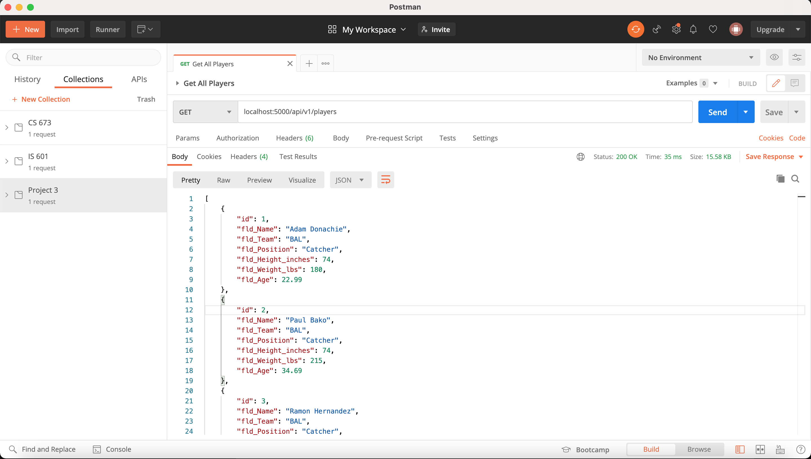

### View a Single Player By Id
API Endpoint of `localhost:5000/api/v1/player/:id` with a `GET` request for a given player `:id`.
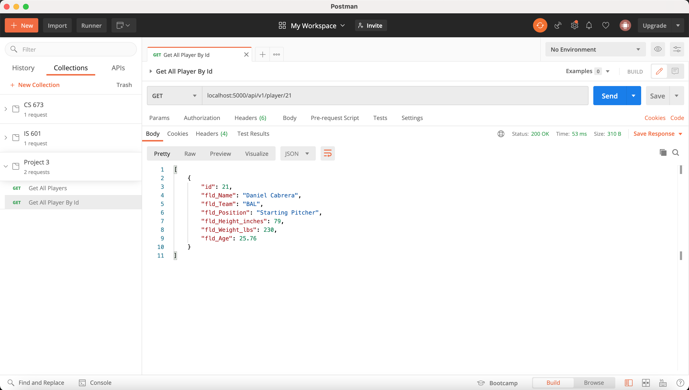

### Add a New Player
API Endpoint of `localhost:5000/api/v1/player` with a `POST` request containing the JSON body payload below.
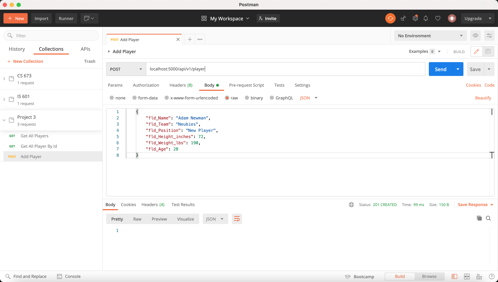

Note that we can query for all players again and see that the new player was added below.
Also note that the player id is 101 since the database will automatically increment the primary key.
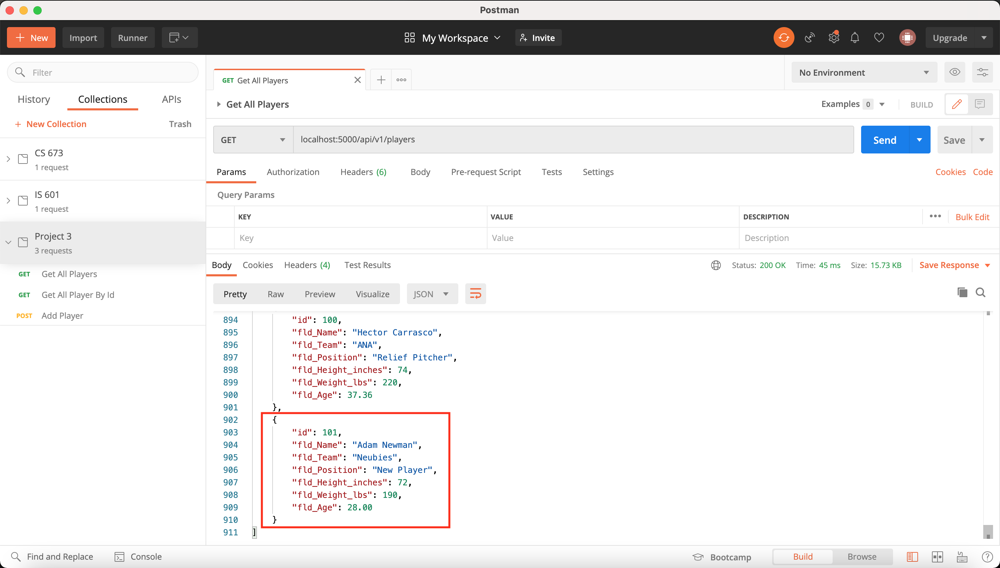

### Update an existing Player
API Endpoint of `localhost:5000/api/v1/player` with a `PUT` request containing the JSON body payload below.
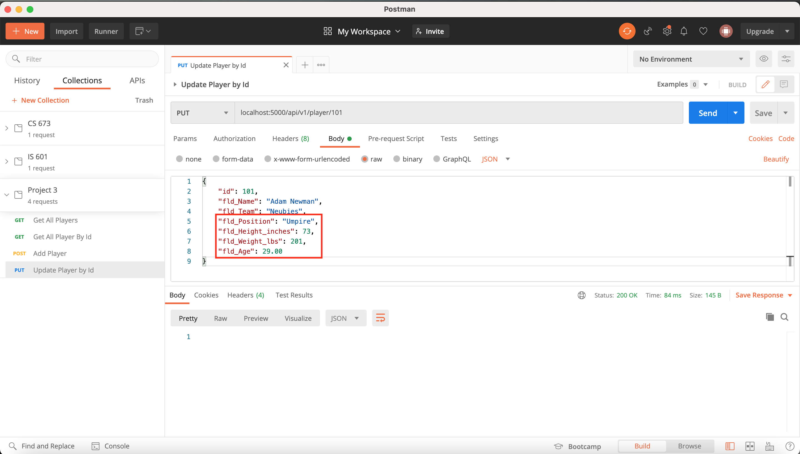

Note that we can query for the player by id again and see that the existing player indeed updated.
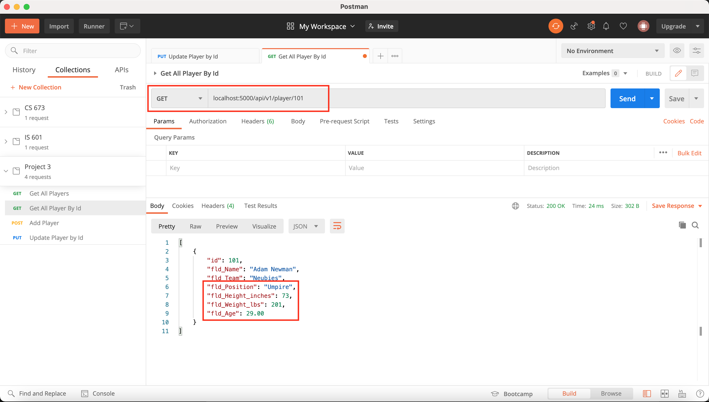

### Delete an existing Player
API Endpoint of `localhost:5000/api/v1/player/:id` with a `DELETE` using the player `:id`.
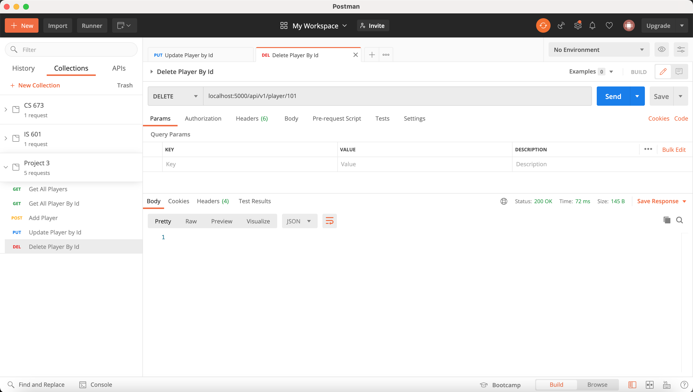

Note that we can query for the player by id again and see that the player no longer exists.
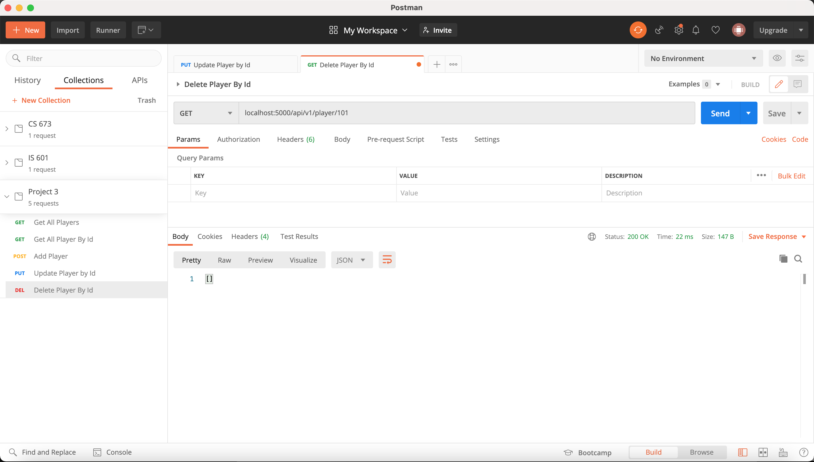

## View Jinja Templates
The project also includes Jinja templates to view the MLB Player data in an HTML format. 
This is the same as was done in [Homework 5](https://github.com/tomtom28/njit-is-601-hw5).

### Homepage (View All Players)
The homepage will be rendered using `index.html` and it will show all the MLB Players in the database.
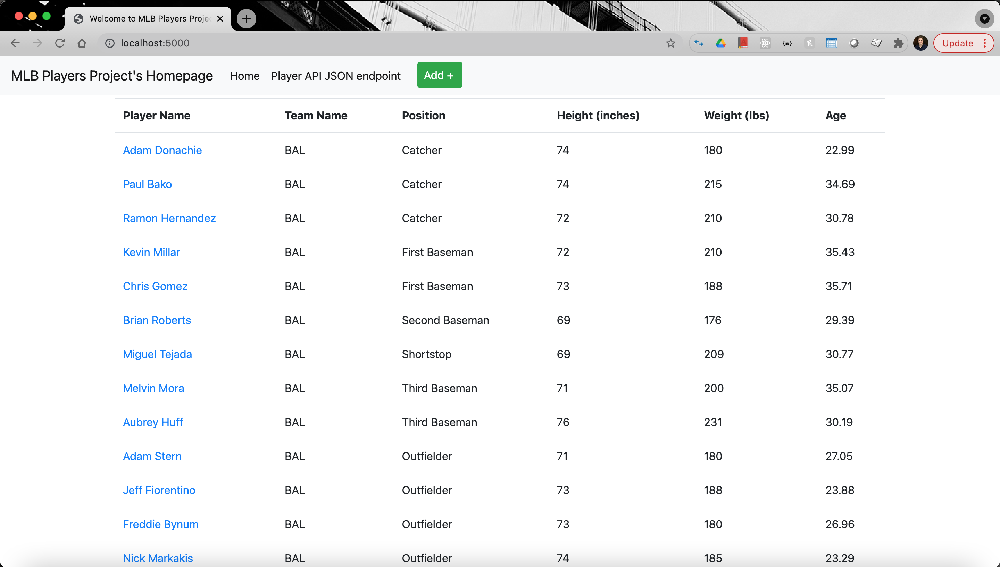

### View Page (View Player by Id)
A view of one player by their database id will be rendered using `view.html`.
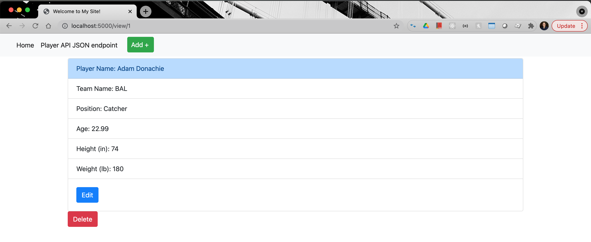

### Add New Player Page
A new player can be added using the `new.html` page.
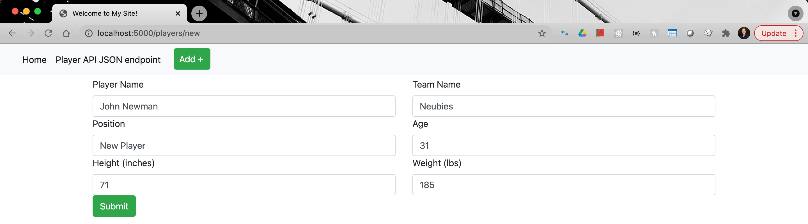

The new player can then be seen at the bottom of the `index.html` page
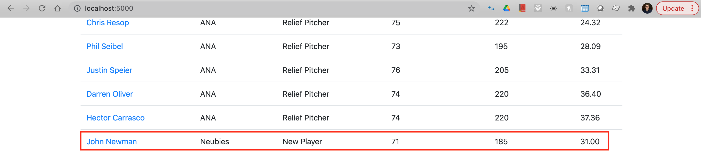

### Edit Existing Player Page
An existing player can be added updated using the `edit.html` page.
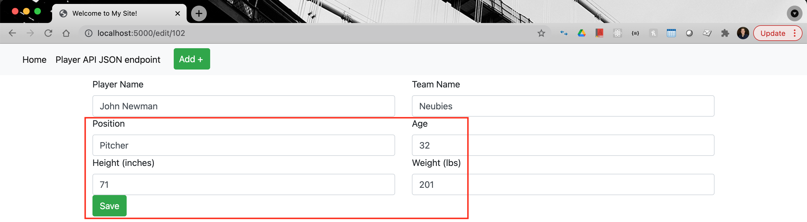

The edited player can then be viewed by their `id` using the `view.html` page
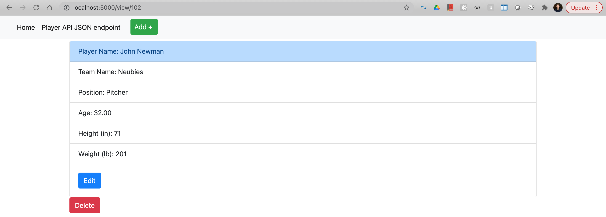

### Delete Existing Player
Using the delete button on the edit player page (`view.html` from above), we can remove the player record by `id`.

The player record will then no longer appear on the `index.html` page
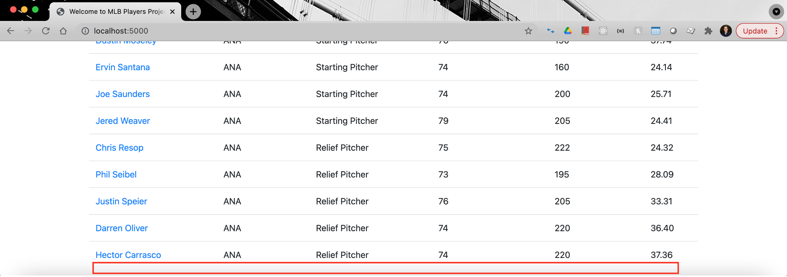