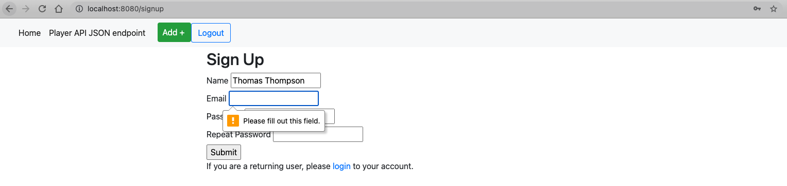
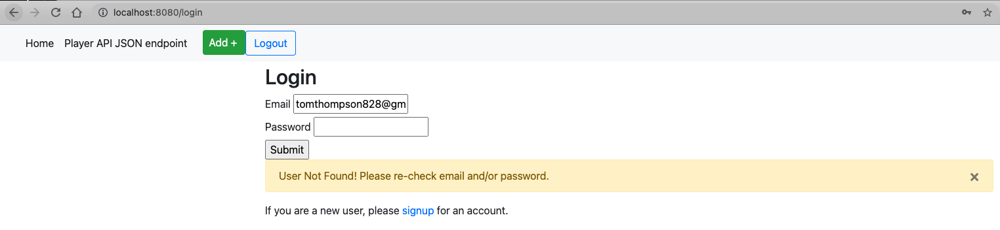
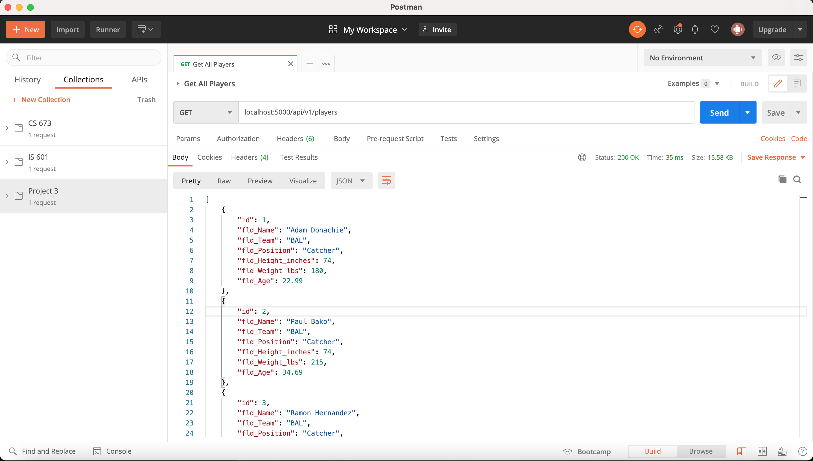

# IS 601 - Project 4

## Project Description
This project's goal was to formalized my knowledge in using Pycharm to set up with Docker, Flask, and MySQL.

The project includes HTML forms to add new records, update records, and delete records.

It also includes REST API and use Postman to test the GET, POST, PUT, and DELETE request methods.

Finally, user authentication was added to the project using the information found in this [tutorial](https://hackersandslackers.com/flask-login-user-authentication).

The MLB Player data was taken from [this](https://people.sc.fsu.edu/~jburkardt/data/csv/csv.html) csv source and converted to SQL statements using [this](https://sqlizer.io/#/) online tool.

## View Jinja Templates
The project includes Jinja templates to view the MLB Player data in an HTML format. 
Aside from the Signup form, Login form, and Logout feature, the functionality is the same as was done in [Project 3](https://github.com/tomtom28/njit-is-601-project-3).

### Sign Up Page
A user can create an account by navigating to the `/signup` route and viewing the `signup.html` page.

The signup page logic is contained in the `SignupForm` class in `forms.py`.

The form validation includes ensuring that the user's `Name` and `Email` are completed and valid.

The form validation also includes verification that the `Password` and `Repeat Password` fields match.

The form also ensures that the same `Email` is not repeatedly submitted. Only new email addresses can be used to create a new account.

### Log In Page
A user can log into an existing account by navigating to the `/login` route and viewing the `login.html` page.

The login page logic is contained in the `LoginForm` class in `forms.py`.

The form will return a `flash` message if the `Email` and `Password` do not match.

### Log Out Button
A user can log out by clicking the "Logout" button at the top of the navbar.

If the user clicks the button without being logged in, an error message will be shown (as seen below).

However, in both situations, the user is always routed back to the `login.html` page.

### Homepage (View All Players)
The homepage will be rendered using `index.html` and it will show all the MLB Players in the database.

Note that users do NOT need to be logged in to see all the players.

### View Page (View Player by Id)
A view of one player by their database id will be rendered using `view.html`.

Note that users do NOT need to be logged in to see a given player's data.

### Add New Player Page
If the user is logged in, a new player can be added using the `new.html` page.

The new player can then be seen at the bottom of the `index.html` page

However, if the `Add+` button is pressed without the user being logged in, then the user will be re-directed to the login page.

### Edit Existing Player Page
An existing player can be added updated using the `edit.html` page.

The edited player can then be viewed by their `id` using the `view.html` page

Note that the `edit.html` page can only be seen if the user is logged in. 
If an unauthorized user clicked `Edit` on the page above, then they would be redirected to the `login` page.

### Delete Existing Player
Using the delete button on the player page (`view.html` from above), we can remove the player record by `id`.

The player record will then no longer appear on the `index.html` page

Note that a user must be authenticated (i.e., logged in) for the `Delete` button to be able to work.
If an unauthorized clicked `Delete` on the page above, then they would be redirected to the `login` page.

## API Endpoint Testing using Postman
As the project was built, each API endpoint was manually tested using Postman. The screenshots below show the results.

### Get All Players
API Endpoint of `localhost:5000/api/v1/players` with a `GET` request.

Note that anyone can view this API data, no user authentication is required.

### View a Single Player By Id
API Endpoint of `localhost:5000/api/v1/player/:id` with a `GET` request for a given player `:id`.

Note that anyone can view this API data, no user authentication is required.

### Add a New Player
API Endpoint of `localhost:5000/api/v1/player` with a `POST` request containing the JSON body payload below.

This endpoint is now secured by an `@login_required` annotation, meaning user authentication is required.

Note that we can query for all players again and see that the new player was added below.
Also note that the player id is 101 since the database will automatically increment the primary key.

### Update an existing Player
API Endpoint of `localhost:5000/api/v1/player` with a `PUT` request containing the JSON body payload below.

This endpoint is now secured by an `@login_required` annotation, meaning user authentication is required.

Note that we can query for the player by id again and see that the existing player indeed updated.

### Delete an existing Player
API Endpoint of `localhost:5000/api/v1/player/:id` with a `DELETE` using the player `:id`.

This endpoint is now secured by an `@login_required` annotation, meaning user authentication is required.

Note that we can query for the player by id again and see that the player no longer exists.

